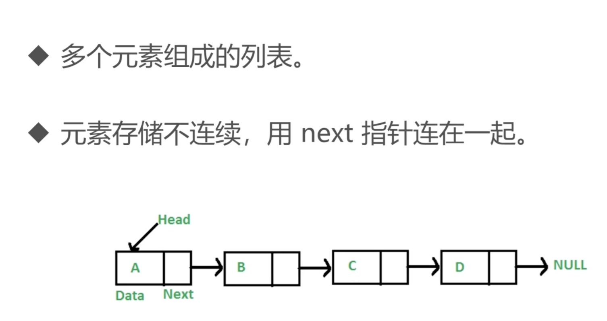

# 链表

## 数组 对比 链表

- 数组： 数组的存储是连续的，增删非首尾元素时往往需要移动元素
- 链表： 链表的元素不是连续的，增删非首尾元素，不需要移动元素，只需更改next指向即可
- 
## 链表的特点
1. 空间上不是连续的
2. 每存放一个值,都要多开销一个引用空间
3. 想要传递一个链表,必须传递链表的根节点
4. 每一个节点,都认为自己是根节点

## 链表的优点

1. 只要内存足够大,就能存的下,不用担心空间碎片的问题
2. 链表的添加和删除非常的容易

## 链表的缺点
1. 查询速度慢(指定查询某个位置)
2. 链表每个节点都需要创建一个指向next的引用,浪费一些空间

## 反转链表
- 反转两个节点： 将n+1的next指向n
- 反转多个节点：双指针遍历链表，重复上边两个节点反转操作

输入： ... -> n -> n+1 -> ...
输出： ... -> n+1 -> n -> ...

输入： 1 -> 2 -> 3 -> 4 -> 5 -> null
输出： 5 ->4 -> 3 -> 2 -> 1 -> null