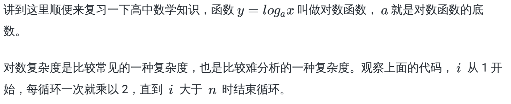
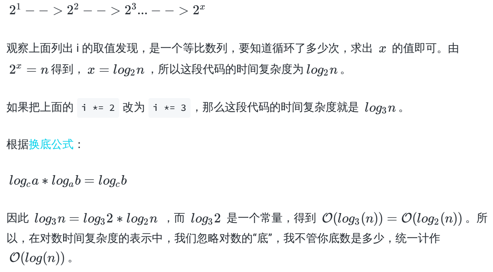
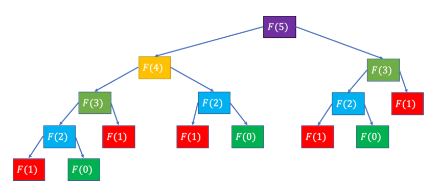
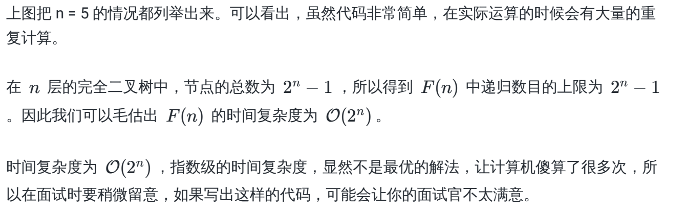
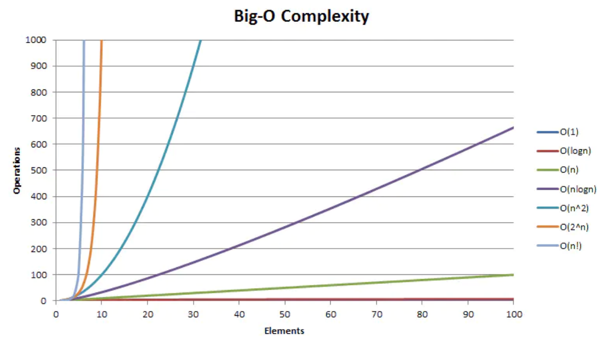

# 数据结构与算法

1. 数据结构与算法有什么关系

```text
可以容纳数据的结构被称为数据结构

算法是用来对数据结构进行处理的方法

数据结构是静态的

算法是动态的

```


## 1、时间复杂度

> 时间复杂度是描述算法的运行时间，我们把算法需要运行的次数用输入大小为n的函数来表示，计作T(n)。时间复杂度通常用O(n)来表示，公式为T(n)=O(f(n)),其中f(n)表示每行代码执行的次数之和，注意是执行次数

### 1、常见的时间复杂度

| 名称 | 运行时间T(n) | 时间举例 | 算法举例 |
| :--: | :----------: | :------: | :------: |
| 常数 |     O(1)     |    5     |    -     |
| 线性 |     O(n)     |    n     | 操作数组 |
| 平方 |    O(n²)     |    n²    | 冒泡排序 |
| 对数 |  O(log(n))   |  log(n)  | 二分搜索 |

1. O(1)复杂度
> 算法执行所需要的时间不随某个变量n的大小而变化，即此算法时间复杂度为一个常量，可表示为O(1)

```js
const a = 1
console.log(a)
```
O(1)表示常数级别的复杂度，不管你是O(几)，统一计作O(1)

2. O(n)复杂度

```js
for(let i = 0; i < n; i++) {
  // ...
}
// 这个for循环，从0到n，不管n是多少，都需要循环n次，而且只循环n次，所以得到复杂度为O(n)
```

3. O(n²)复杂度

```js
for (let i = 0; i < n; i++) {
  for (let j = 0; j < n; i++) {
    // ...
  }
}
// 嵌套for循环，外层从0到n, 内层基于每个不同的i，也要从0到n执行，得到复杂度为O(n²)，随着n增大，复杂度会成平方级别增加
```

4. O(log(n))对数复杂度

```js
for (let i = 0; i <= n; i *= 2) {
  // ...
}
```





5. 递归的时间复杂度

> 在递归算法中，每个递归函数的时间复杂度O(s)，递归的调用用次数为n，则该递归算法的时间复杂度为O(n) = n ∗ O(s)

看一个经典的问题，斐波那契数列( Fibonacci sequence )：
F(0) = 1，F(2) = 1,F(n) = F(n − 1) + F(n − 2)（n ≥ 2,n ∈ N ∗ ）

```js
function fib(n) {
  if (n === 0 || n === 1) {
    return 1
  }
  return fib(n - 1) + fib(n - 2)
}
```
**例题：n = 5**




## 2、空间复杂度
> 空间复杂度是对算法运行过程中临时占用空间大小的度量，一个算法所需的存储空间用f(n)表示，可得出S(n)=O(f(n))，其中n为问题的规模， S(n)表示空间复杂度，通常用S(n)来定义

### 常见空间复杂度

1. O(1)复杂度
> 算法执行所需要的临时空间不随某个变量n的大小而变化，则此算法空间复杂度为一个常量，表示为O(1)

```js
// 以下代码分配的空间不会随着处理数据量的变化而变化，因此得到空间复杂度为 O(1)
const a = 1
const b = 2
console.log(a)
console.log(b)

```

2. O(n)复杂度

```js
// 以下代码第一行申请了长度为n的数组空间，下面for循环中没有分配新的空间，可以得出的时间复杂度为O(n)
const arr = new Array(n)
for(let i = 0; i < n; i++) {
  // ...
}

```
## 3、时间空间相互转换

```text
对于一个算法来说，它的时间复杂度和空间复杂度往往是相互影响的。
当追求一个较好的时间复杂度时，可能需要消耗更多的储存空间。 反之，如果追求较好的空间复杂
度，算法执行的时间可能就会变长。
```
## 总结

常见复杂度由低到高排列为O(1)、 O(log(n))、 O(n)、 O(n²)

